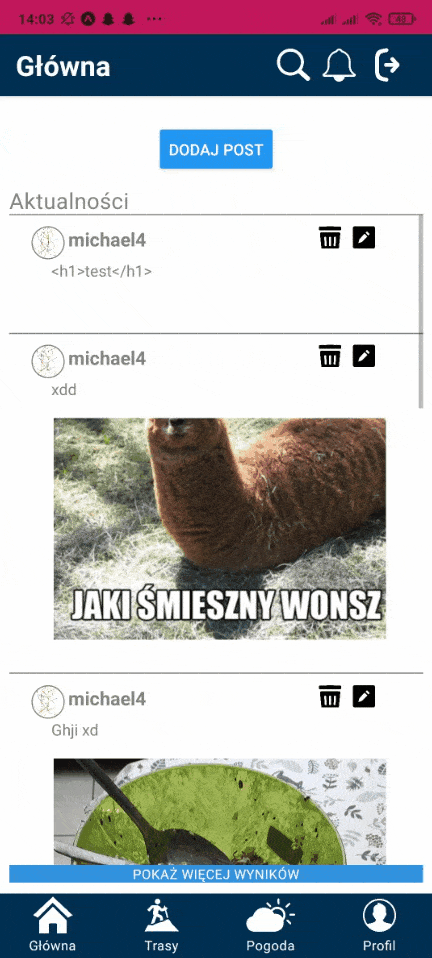

# Mobile_Tourism_App

<h2>1. Views</h2>

  
  
  

<h2>2. Features</h2>
• the ability to create a route based on a start and end point,
 • the ability to edit the route, by changing the starting and/or ending point,
 • the option to complete the route or delete the route,
 • the ability to check the details of the route, i.e. length, estimated walking time and elevation,
 • the ability to check the weather in a given location a week in advance and the current avalanche grade,
 • the capability to register in the system,
 • the ability to log in/out of the system,
 • the ability to edit user account data,
 • the ability to sharing achievements on the user’s profile,
 • the ability to add, delete and edit a post,
 • the ability to display a user profile,
 • the ability to search for other users registered in the system,
 • the ability to follow other users,
 • the ability to send a private message to another system user,
 • the ability to view earned achievements,
 • the ability to obtain a list of users following the user and those followed by the user,
 • the ability to reset the password using the email address assigned to the user account,
 • the ability to display the actual position on the map.
<h2>3. Launching application</h2>
	• Installing the Expo Go app on your phone from google play
	 • Open the Mobile_Tourism_App folder in Visual Studio Code
	 • Moving to the server folder and npm start command
	 • New terminal, move to the app folder and command npm start
	 • Turn on Expo Go - make sure the phone and computer are on the same network
	 • Scan the QR code(or enter the IP, e.g. "exp://192.168.0.10:19000"), which you will see on the terminal